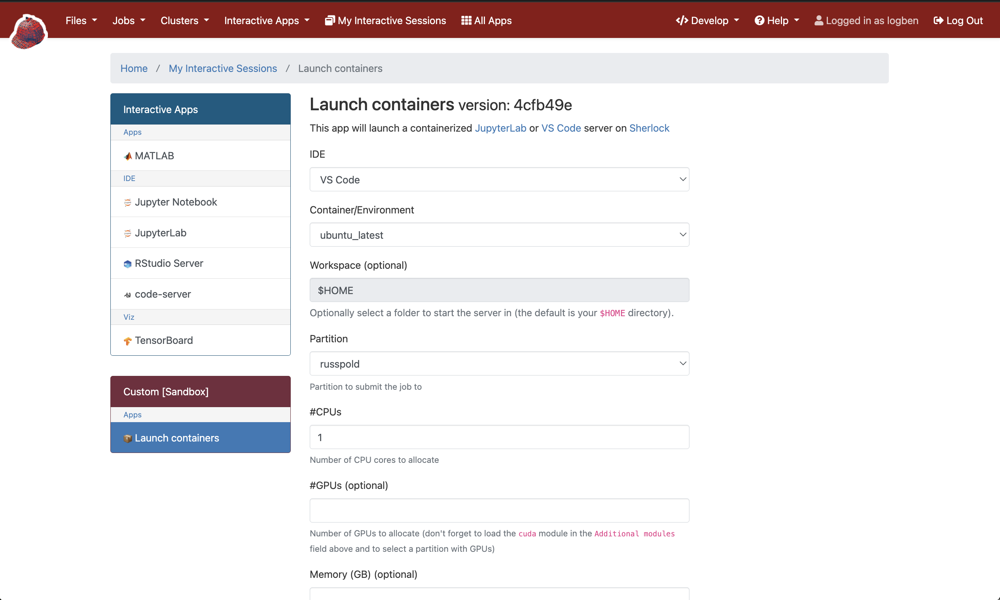

# Sherlock OnDemand Containers

Launch containerized applications (JupyterLab or VS Code) on Sherlock via OnDemand.

## Container Requirements

**Important**: Your containers must have JupyterLab and/or code-server installed to work with this application.

- **JupyterLab**: Must be accessible via `jupyter lab` command
- **VS Code**: Must have `code-server` installed and accessible

## Quick Start Example

Here's a complete working example using Stanford's computational environment container:

1. **Setup**:
   ```bash
   ssh <username>@login.sherlock.stanford.edu
   mkdir -p $HOME/ondemand/dev 
   git clone https://github.com/lobennett/on_demand_containers.git $HOME/ondemand/dev/on_demand_containers
   cd $HOME/ondemand/dev/on_demand_containers
   ```

2. **Add the container** (recommended for large containers):
   ```bash
   sbatch download_container.sh docker://scr.svc.stanford.edu/bil-public/comp-env/ce
   # Wait for job to complete, then run:
   ./refresh_form.sh
   ```

3. **Access your app**:
   - Go to [Sherlock OnDemand](https://ondemand.sherlock.stanford.edu/pun/sys/dashboard/batch_connect/sessions)
   - Look for **Custom [Sandbox]** section
   - Click on your **Containers OnDemand** app
   - Select the container and launch!



## Adding More Containers

For smaller containers, you can use the simple one-command approach:
```bash
./add_container.sh docker://python:3.9
```

For larger containers, use sbatch to avoid memory issues:
```bash
sbatch download_container.sh docker://tensorflow/tensorflow:latest
# Wait for job to complete, then run:
./refresh_form.sh
```

## Container Sources

- **Stanford Registry**: `docker://scr.svc.stanford.edu/bil-public/comp-env/ce` (recommended)
- **Docker Hub**: `docker://python:3.9`, `docker://tensorflow/tensorflow:latest`
- **Any Docker registry**: Use `docker://` format

## Troubleshooting

**Memory errors during download**: Large containers may fail on login nodes
```bash
sbatch download_container.sh docker://container_uri
```

**Container not in dropdown**: Run `./refresh_form.sh`

**Icon not showing**: Restart OnDemand or clear browser cache

**App not visible**: Check that the directory is `$HOME/ondemand/dev/on_demand_containers`

## Manual Setup (Alternative)

If you prefer step-by-step control:
```bash
./download_container.sh docker://scr.svc.stanford.edu/bil-public/comp-env/ce  # Download container
./refresh_form.sh                                                             # Update form options
```

## File Structure

```
├── add_container.sh      # One-command container setup
├── download_container.sh # Download container images  
├── refresh_form.sh       # Update form options
├── form.yml              # OnDemand form (auto-updated)
├── manifest.yml          # App metadata
└── template/script.sh.erb # Launch script
```

## Optional Customization

### App Metadata

Edit `manifest.yml` to customize your app's appearance in OnDemand:

```yml
---
name: My Custom App Name
category: Computing
subcategory: Containers
role: batch_connect
description: "Custom description for your app"
```

### Advanced Configuration

**Container storage**: Images are stored in `$SCRATCH/.apptainer/on_demand_containers/`

**Multiple environments**: Run scripts from different directories to maintain separate container sets

**Custom paths**: Modify `APPTAINER_DIR` in the scripts if needed